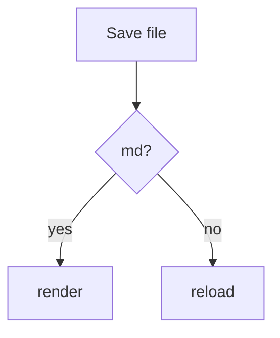

# liz-live-server

A zero-dependency **HTML live server** for Neovim. Runs an async localhost
static HTTP server on libuv (`vim.uv`) and **live-reloads your browser when you
save** — no Node, no external runtime, no polling.

- Pure Lua on Neovim's libuv event loop — never blocks the editor.
- Save → browser reload in well under 200 ms via **Server-Sent Events** (SSE).
- Reloads on **both** Neovim saves (`BufWritePost`) and **external** file
  changes (`fs_event`), coalesced through one 50 ms debounce.
- One command to start, auto browser-open, port `5500` with auto-increment.
- **Markdown preview**: `.md`/`.markdown` files render as pretty, live-reloading
  HTML — GitHub-flavored (tables, task lists, strikethrough), syntax-highlighted
  code, and light/dark theme that follows your browser. Rendered by a small
  first-party client script — no CDN, no external tool, fully offline.
- **Mermaid diagrams**: `` ```mermaid `` fences render as diagrams once you
  run `:LiveServerFetchMermaid` — a one-time download into your Neovim data
  directory, served from your own localhost afterwards. Until you fetch it,
  those fences stay ordinary code blocks.
- Resilient reload client: "disconnected" badge + auto-reconnect with backoff,
  and a resync reload when the connection comes back.
- Optional [lualine](https://github.com/nvim-lualine/lualine.nvim) component —
  not required for core function.

## Requirements

- **Neovim ≥ 0.10** (uses `vim.uv` and `vim.ui.open`).

## Install

### lazy.nvim

```lua
{
  "liz/liz-live-server",
  cmd = {
    "LiveServerStart",
    "LiveServerStop",
    "LiveServerToggle",
    "LiveServerOpenCurrent",
    "LiveServerFetchMermaid",
  },
  keys = {
    -- Recommended: rebind <leader>P from toggle to open-current (start-or-navigate).
    { "<leader>P", "<cmd>LiveServerOpenCurrent<cr>", desc = "Live-server: open/navigate to current buffer" },
  },
  opts = {}, -- calls require("liz-live-server").setup(opts)
}
```

### packer.nvim

```lua
use({
  "liz/liz-live-server",
  config = function()
    require("liz-live-server").setup({})
  end,
})
```

> `setup()` is optional — the plugin works with defaults out of the box. Call it
> only to override options.

## Usage

| Command                  | Action                                                                                             |
| ------------------------ | ------------------------------------------------------------------------------------------------- |
| `:LiveServerStart`       | Start the server (opens browser)                                                                  |
| `:LiveServerStop`        | Stop the server                                                                                    |
| `:LiveServerToggle`      | Toggle on/off                                                                                      |
| `:LiveServerOpenCurrent` | Open the live tab on the current buffer, or navigate it there if already open (start-or-navigate) |
| `:LiveServerFetchMermaid` | Download the Mermaid bundle once, enabling diagram rendering in the Markdown preview |

On start, the server binds `127.0.0.1:5500` (or the next free port), serves the
current working directory (or `root`), and opens your browser. If the current
buffer is an HTML or Markdown file under the root, that page opens directly;
otherwise the site root opens. Every served HTML page (and every rendered
Markdown page) gets a tiny reload script injected automatically — just **save**
any file under the root and the browser refreshes.

### `:LiveServerOpenCurrent`

Start-or-navigate semantics, depending on server state:

- **Stopped** → starts the server (same as `:LiveServerStart`, opening the
  current buffer's page).
- **Running, with an open live tab** → steers the already-open tab(s) to the
  current buffer's page over the existing SSE connection — no restart, no new
  tab.
- **Running, but no tab is currently connected** → opens a new system browser
  tab on the current buffer's page (same fallback as start).

Recommended: rebind `<leader>P` from `:LiveServerToggle` to
`:LiveServerOpenCurrent` (see the lazy.nvim `keys` example above) so one key
always gets you to the current file's live preview without juggling
start/stop.

### Markdown

Requesting a `.md`/`.markdown` file serves an HTML page that renders it in the
browser via a bundled first-party script (`/__liz_md.js`). Supported: headings,
emphasis, links, images, ordered/unordered and task lists, GFM tables,
strikethrough, blockquotes, horizontal rules, and fenced code blocks with a
generic (language-agnostic) syntax highlighter. The theme follows
`prefers-color-scheme` by default; a button in the top-right corner cycles the
theme (auto → light → dark) and remembers your choice across reloads. Raw HTML
inside Markdown is escaped and shown literally (not executed).

#### Mermaid diagrams

Fence a diagram with `` ```mermaid `` and it renders as SVG:

````markdown

````

Mermaid is ~3.5 MB of third-party JavaScript, so the plugin does not ship it and
never loads it from a CDN. Fetch it once:

```vim
:LiveServerFetchMermaid
```

That downloads the bundle to
`stdpath("data")/liz-live-server/mermaid.min.js` and serves it from your own
localhost at `/__liz_mermaid.js`. Reload any open Markdown page and diagrams
appear — no server restart, and no network traffic on later page loads.

Before you fetch it, a `` ```mermaid `` fence renders as a normal highlighted
code block with a one-line hint. The same fallback covers a diagram that fails
to parse: you keep the source you wrote, plus Mermaid's error message. Diagrams
follow the page theme and re-render when you flip the toggle.

## Configuration

Defaults:

```lua
require("liz-live-server").setup({
  host = "127.0.0.1",  -- localhost-only; never exposed off-host
  port = 5500,         -- default; auto-increments if busy
  max_port_tries = 50, -- give up after N busy ports
  open = true,         -- auto-open the browser on start
  root = nil,          -- nil -> current working directory
  debounce_ms = 50,    -- coalesce save bursts into one reload
  ping_ms = 30000,     -- SSE keep-alive interval
  ignore_dirs = { ".git", "node_modules" }, -- pruned from the Linux watch walk

  mermaid = {
    version = "11",   -- npm specifier used to build the download URL
    url = nil,        -- full URL override (skips `version`)
    cache_path = nil, -- nil -> stdpath("data")/liz-live-server/mermaid.min.js
  },
})
```

## Lua API

```lua
local liz = require("liz-live-server")

liz.start()         -- :LiveServerStart
liz.stop()          -- :LiveServerStop
liz.toggle()        -- :LiveServerToggle
liz.open_current()  -- :LiveServerOpenCurrent
liz.fetch_mermaid() -- :LiveServerFetchMermaid (async; notifies on completion)
liz.status()        -- { running, port, clients, error, mermaid }
```

## lualine

Add the component to any section. It renders `  :<port>` while running,
nothing while stopped, and `LiveServer: error` on a start failure.

```lua
require("lualine").setup({
  sections = {
    lualine_x = {
      require("liz-live-server").lualine_component,
      "encoding",
      "fileformat",
      "filetype",
    },
  },
})
```

To also show the connected-client count, wrap it:

```lua
lualine_x = {
  function()
    return require("liz-live-server").lualine_component({ show_clients = true })
  end,
}
```

## How it works

- `server.lua` runs a `vim.uv` TCP server, parses HTTP requests as they arrive
  in chunks, and serves files under the root with `Cache-Control: no-store` so
  the browser always refetches fresh.
- `inject.lua` splices `<script src="/__liz_reload.js">` into every served HTML
  page; the client opens an `EventSource` to `/__liz_reload`.
- `watch.lua` listens via `BufWritePost` and `uv.fs_event` (recursive on
  macOS/Windows; a pruned per-directory walk on Linux), debounces, and calls
  `sse.broadcast("reload")`.
- `sse.lua` holds the open browser connections and pushes the `reload` event.
- `mermaid.lua` owns the fetch-once bundle cache and the `/__liz_mermaid.js`
  route. The route 404s while nothing is cached, which is what makes the
  renderer fall back to code blocks instead of failing.

## Scope

Static files, plus client-side Markdown preview. The only network access the
plugin ever makes is the explicit `:LiveServerFetchMermaid` download; serving
and rendering are offline. No source preprocessing/bundling
(SCSS/TS/JSX served verbatim), no HMR/CSS hot-swap (full-page reload), no
remote/LAN hosting, no HTTPS, no auth — localhost-only by design.

## License

MIT
